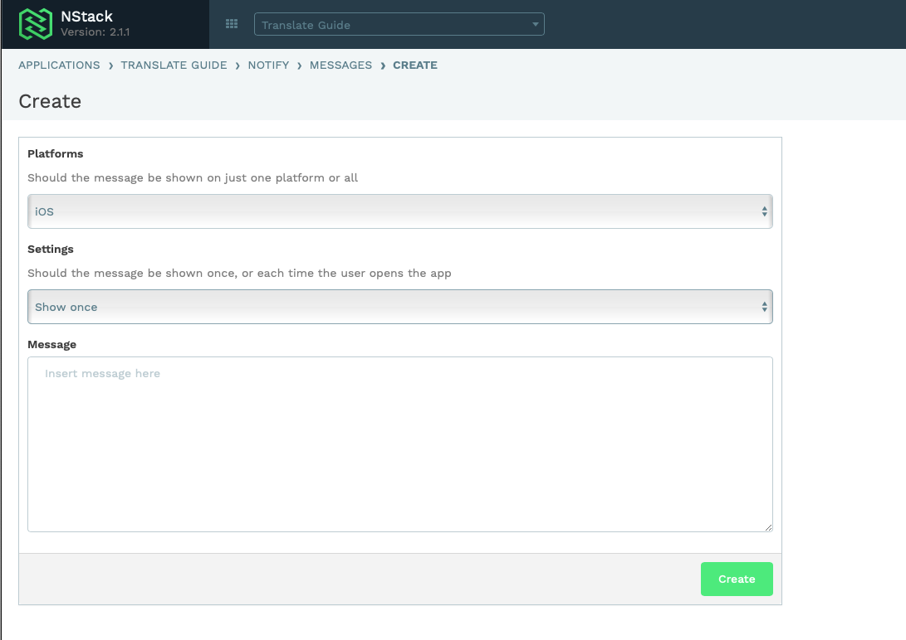

# App open explained

NStack has a feature called App open, which enable apps to pull info from several features in one API request

 - Localize
 - Version control
 - Messages
 - Rate reminder 

### The short story

1. Send phone language, current version to NStack and when the localization was last updated
2. NStack finds best fit language based on language and returns it if the server version is newer than the phone's version
3. NStack checks if Version control has any updates enabled for the received version (i.e. 1.0.0) 
4. NStack checks if there is a Rate reminder set up
5. NStack checks if there are any Messages to retrieve
6. NStack returns all of this in App Open response
7. Phone uses newest translation, updates last updated, shows any Version control dialog if necessary

### The long story

Every consuming platform of NStack bundles a local version of the current Localization. Some versions of NStack bundles all languages for offline change, some don't, but the default language is always bundled. 

Once running the NStack client also caches received translations from the App Open call and overwrites the bundled language on every app start.

 {.uml}

### Publish CDN / App Open V2
Around June 2019, we introduced CDN hosting of language translations. It serves two purposes:

1. "Freezing" a translation at a given time
2. Caching the translation harder

This introduced a small change to the App Open call. Instead of providing the language selected via best fit from the Accept-Language header, it returns all languages in the form:

```
"localize": [
            {
                "id": 938,
                "url": "https://nstack-staging.vapor.cloud/api/v2/localize/resources/938",
                "last_updated_at": "2019-06-21T14:10:29+00:00",
                "should_update": true,
                "language": {
                    "id": 56,
                    "name": "English",
                    "locale": "en_EN",
                    "direction": "LRM",
                    "is_default": true,
                    "is_best_fit": true
                }
            },
```

Notice the url is a direct link to the localize resource, which means the language was updated, but not published, so it's hitting NStack directly. If it was published, we would see the CDN url.

"should_update" is marked as true, which means that language should be locally cached and used from now on.

## Version Control
Also part of the App Open call is Version control. As the name implies, Version control is for getting people to update our app to the latest App Store / Google Play version.

A version can be added as follows:

1. Specify new version that is available in App Store / Google Play i.e. 1.5
2. Update mode can be off, on or forced. If forced the Update prompt is blocking app interaction and the user has to update the app.
3. You can specify a changelog that will be showed on next app launch

Let's make an example. We launched 1.0 a year back, we now want people to upgrade to 2.0 because of breaking API or similar.

We make a force update version entry in NStack:


What will happen for users on version 1.0:

 {.uml}

## Messages

**Messages** can be access from the NStack web console. In the beginning, it gives an overview of current messages based on the desired platform.



To create a **Message**, the **Create** button is located in the upper right corner of the page. When creating a message, you can specify the platform and how often to show message, together with the content of the message.


The following diagram shows the flow of the **Message**.

 {.uml}

Read more about **Messages** in [*Features/Messages*](../../features/messages.html)

## Rate reminder

**Rate reminder** can be access from the NStack web console. 

The following diagram shows the flow of the **Rate reminder**.

 {.uml}

Read more about **Rate Reminder** in [*Features/Rate Reminder*](../../features/rate-reminder.html)

## Terms

The following diagram shows the flow of **Terms**.

 {.uml}

Read more about **Terms** in [*Features/Terms*](../../features/terms.html)
