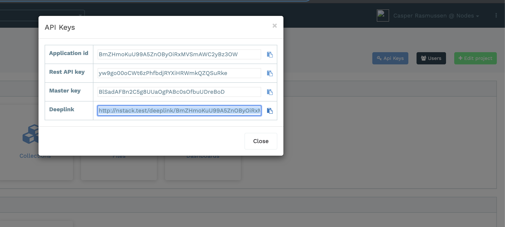

# Deeplink

You can open the NStack website with direct access to one specific application

The url needed looks like this

`https://nstack.io/deeplink/{appplicationId}/{masterKey}`

When an user is clicking the url, the following steps will happen:

1) Check if user is logged, else ask them to login

2) Prompt user that they are about to login to the specific app

3) Check if user has access to the application, else give user access

4) Redirect to application landing page