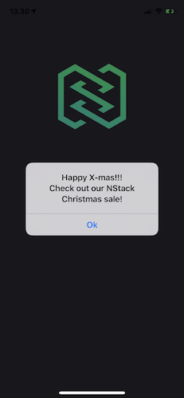

# Messages

Using the Messages feature of NStack can be a great tool for **informing your user** about technical difficulties, new sales or actions, etc.
This message is shown to the user **on app launch**.
You can configure how often the user will see the message, currently 2 options are available:

- "Show always" - Shows the message on **very** app launch
- "Show once" - Shows the message **once** on app launch and will not be shown again after the user presses "OK".  
  (TODO: Add android screenshots)  
  