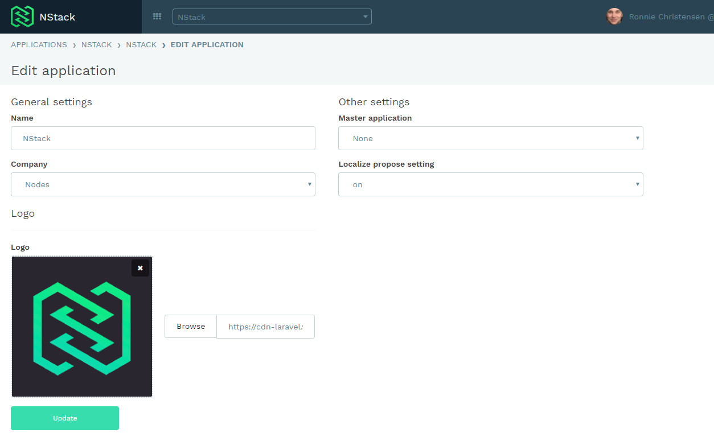

# NStack guide - Getting started

* [Creating a new application](#creating-a-new-application)
* [Accessing NStack](#accessing-nstack)
* [Useful information](#useful-information)
	* [API keys](#api-keys)
	* [Users](#users)
	* [Edit application](#edit-application)

## Creating a new application

Navigate to [NStack projects](https://nstack.io/admin/projects) and press the "Create new application" button

Fill out the requested information

That's it! You now have access to all the features NStack has to offer.

## Accessing NStack

NStack is accessed by getting an invite to the system by email. Your contact person at Nodes will be responsible for sending you an invite. The email will look like the one inserted below.

After clicking the link, you will be presented with a screen, prompting you for a name and a password. Fill out the form as requested and submit your information.

If the form is filled out correctly, you will be presented with the following screen. Click the link to continue to NStack, where you will be prompted to enter the login information you just entered.

If the login is successful, you will be presented with NStacks main screen.

## Useful information

### API keys
The API keys are used for setting up the [sdk's](../docs/sdks.html) and connecting to the api for this particular application.  
You can find them on the selected application page

### Users
In the user section you can manage what users have access to the application and what role/ access level they have.  
See the [user management guide](../docs/guides/user-management.html) for more information

### Edit application
In edit application you can change the Name, company, master application and Logo for your project.

