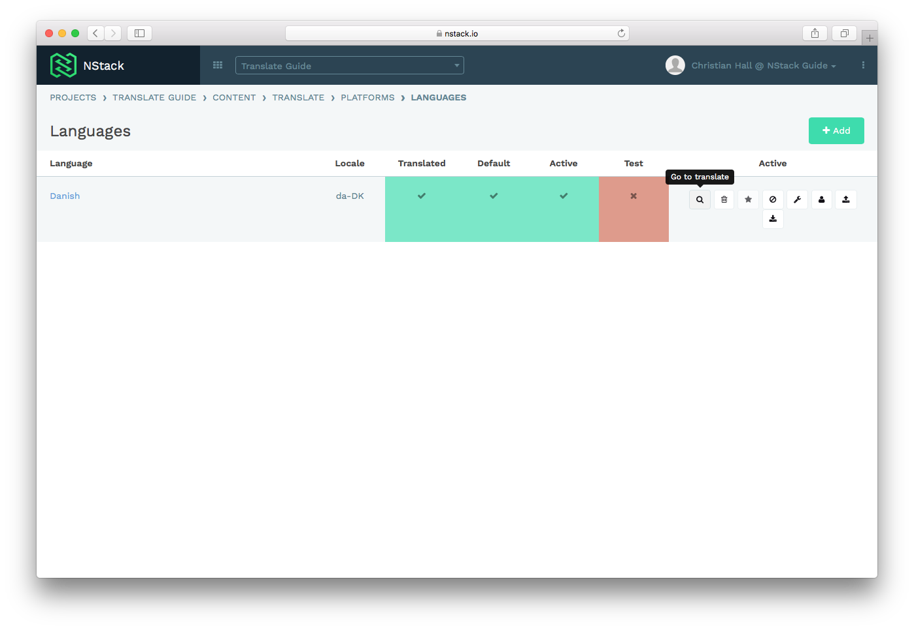
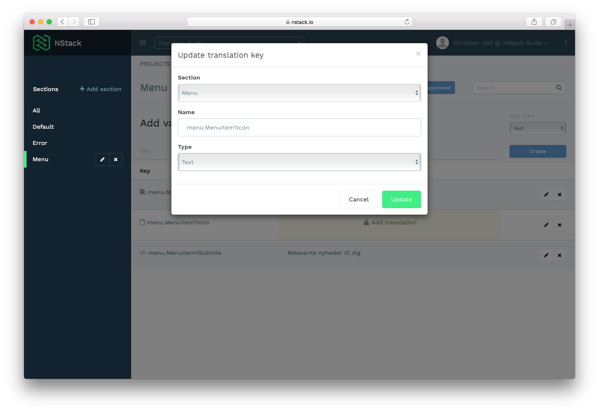
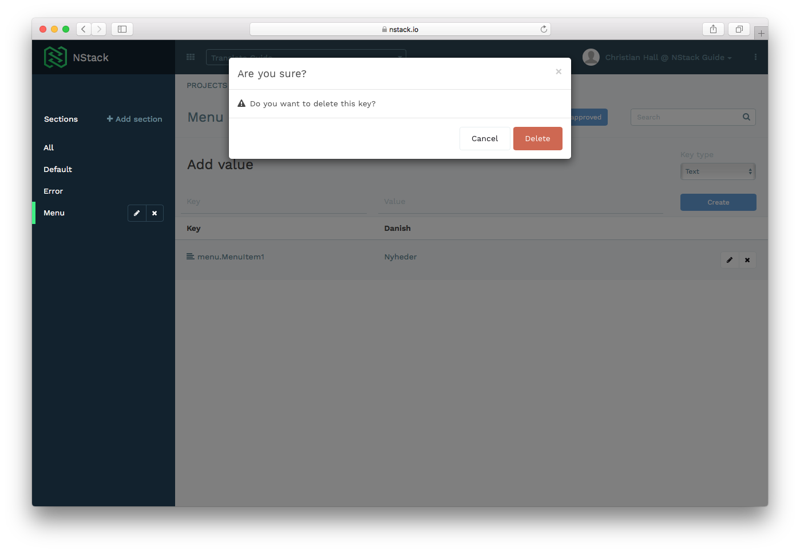

# NStack guide - Localize for Experts

* [Overview](#overview)
	* [System overview](#system-overview)
	* [Guide overview](#guide-overview)
* [Accessing the Translate system](#accessing-the-translate-system) 
* [Setting up a new platform](#setting-up-a-new-platform)
	* [Activating a language](#activating-a-language)
	* [Deactivating a language](#deactivating-a-language)
* [Editing values in a platform](#editing-values-in-a-platform)
	* [Adding a new section](#adding-a-new-section)
	* [Adding a new key](#adding-a-new-key)
	* [Editing a value](#editing-a-value)
	* [Editing a key](#editing-a-key)
	* [Deleting a key](#deleting-a-key)
* [Device development](#device-development)
	* [Test mode](#test-mode)
	* [Language detection](#language-detection)
* [Live example](#live-example)

## Overview
### System overview

The purpose of the Localize feature in NStack is to enable you, as a client, to be able to control all text values in your app. The system is easily extendible, and allows you to maintain multiple languages for your app in one place. The system is hosted on Monstarlab servers, and you gain access to the system by having a Monstarlab employee inviting you via email.

### Guide overview

The purpose of this guide is to present the translation feature “Translate” of NStack. The guide does not cover any other aspects of the NStack. Information on how log in, and how manage users, can be found in the NStack guide that covers the user management part of the system.

NStack is designed to store text values for multiple apps, with multiple platforms and multiple languages. Platforms in NStack are representations of the different parts of an app that make up the app ecosystem, typically being web, mobile and backend. The mobile platform contains text values that are used mainly by the app, the backend contains values that are used solely by the backend, e.g. push notifications text, and the web platform stores values that are used on a website, if any.

## Accessing the Localize system

After logging in, assuming you have just one project, you will be presented with the following screen. If you have access to multiple projects, you’ll have to select a project first. Press the “Localize” button to access the Localize feature of NStack.

 {.screenshot}

## Setting up a new platform

When entering the Translate function of NStack, you must create a new platform, if no platform has been defined yet. Press the “+Add” button to add a platform, and select what type of platform you want to add.

 {.screenshot}
 {.screenshot}
 {.screenshot}

After adding the platform, you have to add a language to the platform in order to use it. This is done by pressing the speech bubble icon.

 {.screenshot}
 {.screenshot}

On the language screen press the “+Add” button to add a language. You’ll have to set the country code and indicate whether the language is active on the platform.

 {.screenshot}

When the new language is set up, you are ready to start adding values to your platform. Out of the box, NStack provides some commonly used default values, and some default error values. Press the magnifying glass icon to access the translation values stored for the platform in the chosen language.

 {.screenshot}

If there is more than one language for the platform, the languages are listed on this page.

 {.screenshot}

### Activating a language

To activate a language, you have to be logged in as an administrator. Go to the platform overview page and select “Languages for platform”. From here, press  the “Activate Language” icon. When you activate a language NStack will be able to serve that language through the API for the apps.

 {.screenshot}

### Deactivating a language

To deactivate a language, you have to be logged in as an administrator. Go to the platform overview page and select “Languages for platform”. From here, press  the “Deactivate Language” icon. When you deactivate a language NStack will not be able to serve that language through the API for the apps.

 {.screenshot}

## Editing values in a platform

To edit translations for a language, press the magnifying Glass icon on the platform you wish to edit. Clicking the magnifying glass icon will present you with a screen showing all translations for the app. NStack creates some default values out of the box, mostly error messages and user notifications. These values are present in all projects, and the keys should not be changed.

 {.screenshot}

On the left side if the screen, a list of current sections are listed, and on the right side, all translation values stored in the section are listed. The section “All” contains all translations, regardless of what section they belong to.

 {.screenshot}

### Adding a new section

To add a new section, press the “Add section” in the left-hand menu. Enter the section name in the popup, noticing the “slug” name. The slug is used when referencing the key programmatically, and you will refer to it when adding new keys as well.

 {.screenshot}

After adding a section, the screen will show the section you just added.

 {.screenshot}

### Adding a new key

To add a new key to the section, enter the slug, a dot and the new key name, as illustrated on the screenshot. The value for the key is what appears in the app. It is not mandatory to enter the value at this point. You have to choose the type of key you want to add as well, depending on what you want to store. Currently the supported types are “Text”, “HTML”, “HTML/CSS” and “File”. After filling out the form, press “Create” to create a new translation key.

 {.screenshot}
 {.screenshot}

### Editing a value

To edit a value, press the row containing the value you want to edit. Do not press the pencil icon, as that edits the key, which could end up hindering the apps access to that key, as the app refers to the key to extract the value from NStack. Press “Update” when you are satisfied with your edit.

 {.screenshot}

Edited values does not immediately take effect in the app, but is read next time the app is restarted. To force a refresh of the translation values, restart the app.

### Editing a key

To edit a key, press the pencil icon, and you are now able to edit the section, name and type of the key. Editing these, are not the same as editing a key’s value. Editing these values could end up hindering the apps access to that key, as the app refers to the key to extract the value from NStack.

 {.screenshot}

### Deleting a key

To delete a value, press the cross icon in the row containing the value. If you are sure that the app is not using the translation key, confirm the deletion.

 {.screenshot}

## Device development

This section primarily covers device development and specific info as to how the NStack SDK works on devices.

### Test mode

When test mode is enabled, all translations are prefixed with pound signs “#”.

### Language detection

The NStack SDK detects what language should be used based on the phone language. The SDK sends the language code to the API, and if the language is available in NStack, the API serves the translations for that language to the app. If the language is not available, the default language in NStack is used instead. On top of that, the NStack SDK has a language picker, that returns active languages on the platform.

## Live example

The following shows an example of an in-app screen, with some of the corresponding values in NStack. Changing the values in NStack will change the value in the app.

